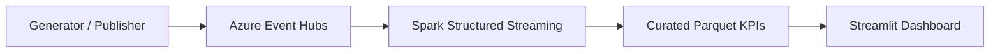

# Stream Analytics Demo Project

This repository is a **single integrated system**: a configurable Python generator and publisher emit realistic `order_events` and `courier_status` streams to **Azure Event Hubs**; a **Spark Structured Streaming** job ingests and validates events, applies **event-time windows and watermarks**, and writes a **curated Parquet metrics dataset**; a **Streamlit** dashboard reads that dataset and can **start, stop, and reset** the live demo while surfacing pipeline health.

## Table of Contents

- [System overview](#system-overview)
- [Repository layout](#repository-layout)
- [Prerequisites](#prerequisites)
- [Install and test](#install-and-test)
- [Run the integrated demo](#run-the-integrated-demo)
- [Data model](#data-model)
- [Generator](#generator)
- [Azure Event Hubs publisher](#azure-event-hubs-publisher)
- [Spark streaming pipeline](#spark-streaming-pipeline)
- [Streamlit dashboard](#streamlit-dashboard)
- [Demo controls and observability](#demo-controls-and-observability)
- [Verify windows, metrics, and the UI](#verify-windows-metrics-and-the-ui)
- [Grader rubric mapping](#grader-rubric-mapping)
- [Production readiness](#production-readiness)
- [Further reading](#further-reading)
- [License](#license)

---

## System overview

End-to-end data flow:



- **Upstream:** Synthetic events mirror a food-delivery platform (orders and courier status), with tunable realism and streaming edge cases (late events, duplicates, and so on).
- **Messaging:** Both feeds are published to Event Hubs with partition keys suited to zone- and courier-scoped analytics.
- **Processing:** Spark consumes both hubs, validates records (invalid rows go to an error sink), windows on event time, and materializes dashboard-ready metrics.
- **Experience:** The dashboard shows KPIs, health/anomaly views, and live run status driven by shared status files under `status/`.

For a step-by-step demo with preflight checks and recovery, use the [Demo runbook](docs/demo_runbook.md).

---

## Repository layout

| Piece | Location |
| --- | --- |
| This README | Overview, run paths, troubleshooting |
| Design note | [docs/design_note.md](docs/design_note.md): fields, assumptions, planned analytics |
| Generator | `stream_analytics/generator/`; config: `config/generator.yaml` |
| AVRO schemas | `stream_analytics/generator/schemas/order_events.avsc`, `courier_status.avsc` |
| Event Hubs publisher | `stream_analytics.publisher.event_hub_publisher` |
| Spark jobs | `stream_analytics.spark_jobs/`; config: `config/spark_jobs.yaml` |
| Dashboard | `stream_analytics/dashboard/app.py`; config: `config/dashboard.yaml` |
| Sample batches (CLI) | `samples/generator/` after `python -m stream_analytics.generator.cli --sample` |
| Curated metrics sink | `data/metrics_by_zone_restaurant_window` (configurable) |
| Run state | `status/generator_status.json`, `status/spark_job_status.json` |

**Team structure:** Solo developer. Update this note if the project gains more contributors.

---

## Prerequisites

- Python 3.10 or newer
- Pip and a virtual environment (`venv` or `conda`)
- Git (to clone the repository)
- For the **full pipeline**: Azure Event Hubs namespace, hubs for both feeds, and connection strings with appropriate send/listen policies (see runbook and sections below)

---

## Install and test

From the project root:

```bash
python -m venv .venv
# macOS / Linux
source .venv/bin/activate
# Windows (PowerShell)
.venv\Scripts\Activate.ps1

pip install -r requirements.txt
pytest
```

**Generate local sample files only** (no Azure required):

```bash
python -m stream_analytics.generator.cli --sample
```

Outputs:

- `samples/generator/order_events/json/sample.jsonl`
- `samples/generator/order_events/avro/sample.avro`
- `samples/generator/courier_status/json/sample.jsonl`
- `samples/generator/courier_status/avro/sample.avro`

---

## Run the integrated demo

These steps tie every component together; details and PowerShell-first variants live in [docs/demo_runbook.md](docs/demo_runbook.md).

1. **Install** as in [Install and test](#install-and-test). For the UI, install Streamlit if needed: `pip install streamlit`.

2. **Configure Azure** — set publisher and Spark connection strings (example PowerShell):

   ```powershell
   $env:EVENTHUB_CONNECTION_STRING="Endpoint=sb://<namespace>.servicebus.windows.net/;SharedAccessKeyName=<policy>;SharedAccessKey=<key>"
   $env:SPARK_EVENTHUB_CONNECTION_STRING="Endpoint=sb://<namespace>.servicebus.windows.net/;SharedAccessKeyName=<policy>;SharedAccessKey=<key>"
   ```

   Optional hub name overrides: `GENERATOR_EVENT_HUBS_ORDER_TOPIC`, `GENERATOR_EVENT_HUBS_COURIER_TOPIC`, `SPARK_JOBS_ORDER_EVENT_HUB_NAME`, `SPARK_JOBS_COURIER_EVENT_HUB_NAME`.

3. **Align config files** — `config/spark_jobs.yaml` (hub names, checkpoints, error sink, window and metrics paths) and `config/dashboard.yaml` (`generator_command`, `spark_command`, `metrics_path`, `refresh_seconds`). Ensure working directories such as `status/` and `logs/` exist or will be created.

4. **Launch the dashboard** from the project root:

   ```bash
   streamlit run stream_analytics/dashboard/app.py
   ```

5. **In the app:** use **Start Demo** to run the configured publisher and Spark ingestion; watch **Pipeline Status** and **Last Processed Batch** until data is flowing; explore **Overview** and **Health/Anomalies**. Use **Stop Demo** or **Reset Demo** for a clean shutdown or fresh run.

---

## Data model

### Feeds

Two feeds represent core platform dynamics:

1. **`order_events`** — Order lifecycle (created, accepted, assigned, picked up, delivered, cancelled) with timestamps, amounts, and delivery metrics.
2. **`courier_status`** — Courier availability and position (online, offline, assigned, en route, idle) with optional active-order linkage.

**Why both matter:** Order events drive demand and fulfillment KPIs; courier status drives supply-side and joinable context. Together they support windowed KPIs, event-time processing, anomaly detection (impossible durations, missing steps, courier offline while delivering), and zone-level stress views.

**Event time and joins:** Both feeds include `event_time` (microsecond resolution) for watermarks and Spark timestamps. Identifiers `order_id`, `restaurant_id`, `courier_id`, and `zone_id` support joins and reference patterns. [docs/design_note.md](docs/design_note.md) documents edge-case encoding for late data and validation.

### Schema summary

| Feed | Schema file | Key fields |
| --- | --- | --- |
| `order_events` | `order_events.avsc` | `order_id`, `restaurant_id`, `courier_id`, `zone_id`, `event_time`, `status`, `total_amount`, `delivery_time_seconds` |
| `courier_status` | `courier_status.avsc` | `courier_id`, `zone_id`, `event_time`, `status`, `active_order_id` |

Schemas live under `stream_analytics/generator/schemas/` with enums, optional fields, and `schema_version`. The generator can emit **JSON** and/or **AVRO** per `config/generator.yaml`.

### Realism and streaming edge cases

- **Demand:** `low` / `medium` / `high`; tunable zones, restaurants, couriers, and events per second.
- **Edge cases** (for watermark and correctness demos):

| Edge case | Config field | Role |
| --- | --- | --- |
| Out-of-order (late) | `late_event_rate` | Late timestamps vs processing order |
| Duplicates | `duplicate_rate` | Idempotency / dedup scenarios |
| Missing steps | `missing_step_rate` | Invalid lifecycles |
| Impossible durations | `impossible_duration_rate` | Anomaly signals |
| Courier offline mid-delivery | `courier_offline_rate` | Supply health edge case |

---

## Generator

### Configuration

Core settings: `config/generator.yaml`. Overrides use the `GENERATOR_` prefix, for example:

```bash
export GENERATOR_ZONE_COUNT=6
export GENERATOR_EVENTS_PER_SECOND=120
export GENERATOR_OUTPUT_BASE_DIR="data/samples"
export GENERATOR_OUTPUT_FORMATS='["json"]'
```

Print resolved configuration:

```bash
python -m stream_analytics.generator.cli --print-config
```

### Observing edge cases locally

1. Set non-zero rates in `config/generator.yaml`, for example:

   ```yaml
   late_event_rate: 0.2
   duplicate_rate: 0.2
   missing_step_rate: 0.1
   impossible_duration_rate: 0.1
   courier_offline_rate: 0.1
   ```

2. Run:

   ```bash
   python -m stream_analytics.generator.cli --sample --debug-sample --debug-seed 42 --output-dir samples/generator
   ```

3. Inspect outputs under `samples/generator/`.

---

## Azure Event Hubs publisher

The publisher sends both feeds to Event Hubs.

1. Set credentials and optional topic names (see [Run the integrated demo](#run-the-integrated-demo)).

2. **One batch per feed:**

   ```bash
   python -m stream_analytics.publisher.event_hub_publisher --batch
   ```

3. **Continuous stream** (Ctrl+C to stop):

   ```bash
   python -m stream_analytics.publisher.event_hub_publisher --continuous
   ```

4. **Dry run** (no Azure I/O):

   ```bash
   python -m stream_analytics.publisher.event_hub_publisher --batch --dry-run
   ```

**Partition keys:** `order_events` uses `zone_id` (zone ordering and colocation); `courier_status` uses `courier_id` (per-courier timeline). Failed batch sends retry up to three times.

**Troubleshooting:** `Unauthorized` / CBS errors → connection string and SAS send rights. Wrong hub → check `GENERATOR_EVENT_HUBS_ORDER_TOPIC` and `GENERATOR_EVENT_HUBS_COURIER_TOPIC`. Throughput pressure → lower `sample_batch_size_per_feed` or `events_per_second`, or scale Event Hubs capacity.

---

## Spark streaming pipeline

### Ingestion and validation

Configuration: `config/spark_jobs.yaml` (example):

```yaml
order_event_hub_name: order-events
courier_event_hub_name: courier-status
consumer_group: $Default
starting_position: latest
checkpoint_base_dir: checkpoints/spark_jobs
error_sink_path: logs/spark_ingestion_errors.jsonl
```

Set `SPARK_EVENTHUB_CONNECTION_STRING` for the namespace. Optional env overrides: `SPARK_JOBS_ORDER_EVENT_HUB_NAME`, `SPARK_JOBS_COURIER_EVENT_HUB_NAME`, `SPARK_JOBS_STARTING_POSITION`, etc.

**Behavior:** Valid records continue through the pipeline. Invalid records go to the error sink with reason codes such as `parse_error`, `schema_mismatch`, `missing_field`, `invalid_timestamp`, and `invalid_feed_type`. Job status is reflected in `status/spark_job_status.json` (`RUNNING`, `STOPPED`, `ERROR`).

**Troubleshooting:** Missing `SPARK_EVENTHUB_CONNECTION_STRING` fails at config load. Wrong hub names or `starting_position` vs checkpoints affect replay. If no valid output appears, inspect `logs/spark_ingestion_errors.jsonl`.

### Event-time windows and watermarks

- `event_time` (microseconds) becomes UTC Spark timestamp `event_time_ts`.
- Windowing: `watermark_delay`, `window_duration`, `window_slide`, `window_output_mode` in `config/spark_jobs.yaml`.
- In-memory window sinks include `order_events_windowed_kpis` and `courier_status_windowed_kpis`; window columns use `window_start` and `window_end`.

Example env overrides:

```powershell
$env:SPARK_JOBS_WATERMARK_DELAY="10 minutes"
$env:SPARK_JOBS_WINDOW_DURATION="10 minutes"
$env:SPARK_JOBS_WINDOW_SLIDE="5 minutes"
```

Run the ingestion job with the publisher generating mixed on-time and late events; check logs for watermark initialization and window batch observability. Confirm late records within the lateness bound update state; records older than `max_event_time - watermark_delay` are dropped from windowed aggregation paths.

### Curated metrics dataset

Denormalized Parquet for the dashboard:

- **Path:** `data/metrics_by_zone_restaurant_window` (default; configurable via `metrics_sink_path`)
- **Checkpoint:** e.g. `checkpoints/spark_jobs/metrics_by_zone_restaurant_window` (`metrics_checkpoint_dir`)
- **Dimensions:** `zone_id`, `restaurant_id`, `window_start`, `window_end`
- **Core KPIs:** `active_orders`, `avg_delivery_time_seconds`, `cancellation_rate`, `total_orders`
- **Health / stress:** `orders_per_active_courier`, `zone_stress_index`, `delivery_time_ratio`, `stress_threshold`, `is_stressed`

Example config snippet:

```yaml
metrics_sink_path: data/metrics_by_zone_restaurant_window
metrics_checkpoint_dir: checkpoints/spark_jobs/metrics_by_zone_restaurant_window
stress_index_threshold: 0.75
```

Keep data and checkpoint paths distinct to avoid duplicate writes on restart. Data layout is typically `data/metrics_by_zone_restaurant_window/window_start=<...>/part-*.parquet`.

---

## Streamlit dashboard

The app reads curated Parquet metrics and exposes **Overview** (KPI cards and active-orders trend), **Health/Anomalies**, and **Debug/Status** views.

**Configuration:** `config/dashboard.yaml`, for example:

```yaml
metrics_path: data/metrics_by_zone_restaurant_window
refresh_seconds: 15
```

Optional env: `DASHBOARD_METRICS_PATH`, `DASHBOARD_REFRESH_SECONDS`.

```bash
streamlit run stream_analytics/dashboard/app.py
```

If no Parquet data exists yet, the Overview page shows an explicit empty state instead of crashing.

---

## Demo controls and observability

The dashboard can orchestrate the live stack:

- **Start Demo** — starts the configured generator/publisher and Spark commands (idempotent if already running).
- **Stop Demo** — stops managed processes and updates status files.
- **Reset Demo** — clean stop and reset of batch timestamp state for a fresh run.

**Status artifacts** (under `status/`):

- `status/generator_status.json`
- `status/spark_job_status.json`

Each includes `status` (`RUNNING`, `STOPPED`, `ERROR`), `last_heartbeat_ts`, `last_batch_ts`, `debug_mode`, and `message`.

**Orchestration commands** in `config/dashboard.yaml`:

```yaml
status_dir: status
generator_command:
  - python
  - -m
  - stream_analytics.publisher.event_hub_publisher
  - --continuous
spark_command:
  - python
  - -m
  - stream_analytics.spark_jobs.ingestion
```

**Pipeline UI:** per-process badges, **Last Processed Batch** from `last_batch_ts` (UTC and local), and **Batch Age** to detect stalls. Prefer `refresh_seconds` around 10–15 seconds. If checkpoint-derived batch times are missing, the Spark status message may document a heartbeat-based approximation.

**Troubleshooting orchestration:** Missing `generator_command` / `spark_command` in config. Stale `status/*.pid` → **Reset Demo** or manual cleanup. Corrupt JSON status files → delete; the dashboard recreates safe defaults. **Pipeline:** RUNNING but high batch age → check Spark logs and `status/spark_job_status.json` `message`. Persistent “waiting for first batch” → confirm Event Hubs traffic and Spark ingestion.

Full checklist: [docs/demo_runbook.md](docs/demo_runbook.md).

---

## Verify windows, metrics, and the UI

### Windowed KPIs (Spark SQL)

```sql
SELECT window_start, window_end, zone_id, feed_type, event_count
FROM order_events_windowed_kpis
ORDER BY window_start DESC;
```

### Curated Parquet

```sql
SELECT
  zone_id,
  restaurant_id,
  window_start,
  window_end,
  total_orders,
  active_orders,
  avg_delivery_time_seconds,
  cancellation_rate,
  orders_per_active_courier,
  zone_stress_index,
  is_stressed
FROM parquet.`data/metrics_by_zone_restaurant_window`
ORDER BY window_start DESC, zone_id, restaurant_id;
```

### CLI inspector

```bash
python -m stream_analytics.spark_jobs.inspect_curated_parquet --path data/metrics_by_zone_restaurant_window --limit 5
```

### Quick UI walk-through

1. `streamlit run stream_analytics/dashboard/app.py`
2. If Spark is not **RUNNING**, click **Start Demo** and wait for **Last Processed Batch**.
3. On **Overview**, change zone, restaurant, and time window; confirm KPIs and trend update.
4. On **Health/Anomalies**, adjust threshold and top-N; confirm rankings match expectations.
5. On **Debug/Status**, confirm batch age refreshes while the pipeline runs.

---

## Grader rubric mapping

| Tier | Use case | Dashboard | What to do | What you should see | Data / code path | Signals |
| --- | --- | --- | --- | --- | --- | --- |
| Basic | Windowed KPI monitoring | `Overview` | Choose `Overview`; set `Zone`, `Restaurant`, `Time window` as needed | KPI cards and `Active Orders Trend` track filters | `data/metrics_by_zone_restaurant_window`: `active_orders`, `avg_delivery_time_seconds`, `cancellation_rate`, `window_start`, `window_end`; built via `stream_analytics.spark_jobs.windowed_kpis.build_windowed_kpi_df` | Filter caption; auto-refresh shows live movement during demos |
| Intermediate | History-aware supply pressure | `Overview` + `Health/Anomalies` | Lock zone/restaurant; change `Time window`; open `Health/Anomalies` with same zone | Overview context and health ranking shift with the window | `orders_per_active_courier` in `build_windowed_kpi_df`; `zone_stress_index` in `stream_analytics.spark_jobs.anomaly_scores.add_zone_stress_metrics` | Same zone, different windows → different ranks with fixed threshold/top-N |
| Advanced | Stress / hotspot detection | `Health/Anomalies` | Default-ish threshold (~0.8); inspect top zones | Stressed zones ranked; threshold and top-N bound output | `zone_stress_index`, `delivery_time_ratio`, `stress_threshold`, `is_stressed` in `add_zone_stress_metrics`; filters in `stream_analytics.dashboard.app.apply_health_filters` | **Debug/Status** + pipeline badges and `last_batch_ts` during live runs |

---

## Production readiness

Tradeoffs, demo boundaries, and a concrete hardening plan (reliability, scale, governance, security) are documented here:

- [Production readiness reflection](docs/production_readiness_reflection.md)

---

## Further reading

- [Design note](docs/design_note.md)
- [Demo runbook](docs/demo_runbook.md)
- [Production readiness reflection](docs/production_readiness_reflection.md)
- [AVRO schemas](stream_analytics/generator/schemas/)

---

## License

See the repository for license terms.
